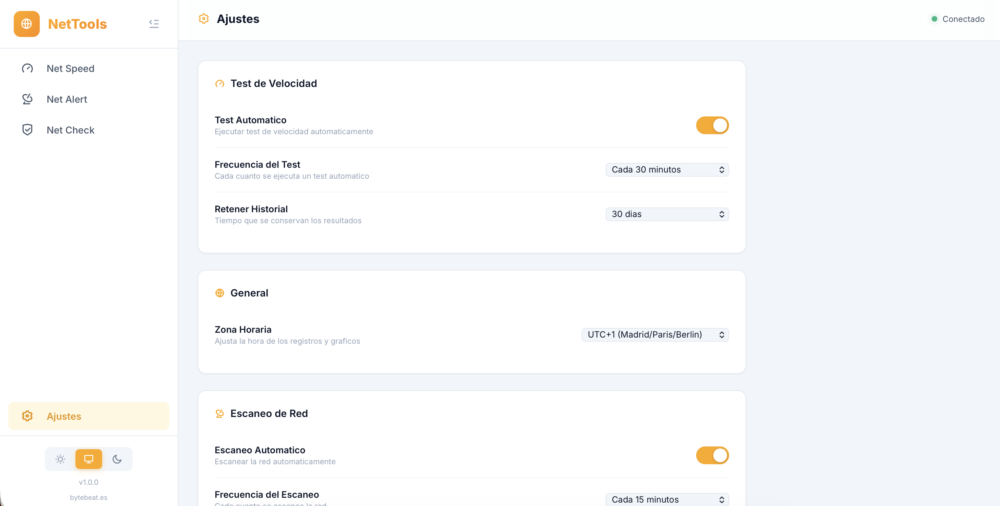

<p align="center">
  
</p>

<h1 align="center">NetTools</h1>

<p align="center">
  <strong>Self-hosted network monitor and speed test</strong>
</p>

<p align="center">
  <a href="#docker-installation">Docker</a> &bull;
  <a href="#manual-installation">Manual</a> &bull;
  <a href="#features">Features</a> &bull;
  <a href="#screenshots">Screenshots</a> &bull;
  <a href="#api">API</a>
</p>

<p align="center">
  
  
  
  
</p>

---

## Description

**NetTools** is a self-hosted web application to monitor your local network and measure your Internet connection speed. It provides a modern, responsive interface with three main modules: **Net Speed** (speed tests), **Net Alert** (device discovery) and **Net Check** (diagnostic tools).

### Key Features

- Automatic and manual speed tests with **Ookla Speedtest CLI**
- Local network device discovery with **arp-scan** and **nmap**
- Diagnostic tools: **Ping**, **Traceroute** and **NSLookup**
- **Telegram** notifications when new devices are detected
- Interactive charts with speed, latency and device history
- Light, dark and auto themes
- Customizable accent colors
- Configurable timezone
- Full REST API
- No cloud dependencies - everything runs on your server

---

## Features

### Net Speed
- Manual speed test with server selection
- Scheduled automatic tests (15 min - 24 h)
- Speed history charts (download/upload)
- Latency charts (ping/jitter)
- Hourly speed averages
- Recent tests table
- Statistics: best download, best upload, best ping, total tests

### Net Alert
- Automatic local network scan (arp-scan + nmap)
- New device detection
- Manufacturer identification by MAC address
- Device editing: name, type, location, description
- Static IP or DHCP tagging
- Filters: all, online, offline, new, saved, manual
- Sort by name, IP, MAC, manufacturer, location, status
- Connected devices history (chart)
- Telegram notifications for new devices
- Quick ping from device card

### Net Check
- **Ping**: single IP or all saved devices
- **Traceroute**: route visualization with hop map and detailed table
- **NSLookup / DNS**: A, AAAA, MX, NS, TXT, CNAME, SOA, PTR, SRV, ANY queries with DNS server selector

### Settings
- Automatic test frequency
- Network scan frequency
- Network range (CIDR)
- History retention
- Timezone
- Telegram notifications (bot token + chat ID + connection test)
- Color customization (accent, background, download, upload)
- Data export (JSON)
- History and device cleanup

---

## Docker Installation

### Docker Run

```bash
docker run -d \
  --name nettools \
  --network host \
  -v nettools-data:/data \
  -e TZ=Europe/Madrid \
  --restart unless-stopped \
  mbraut/nettools:latest
```

### Docker Compose

```yaml
services:
  nettools:
    image: mbraut/nettools:latest
    container_name: nettools
    restart: unless-stopped
    network_mode: host
    volumes:
      - nettools-data:/data
    environment:
      - TZ=Europe/Madrid

volumes:
  nettools-data:
    driver: local
```

```bash
docker compose up -d
```

Access **http://your-server:8080**

> **Note:** `network_mode: host` is required for `arp-scan` and `nmap` to discover devices on your local network. Without it, speed tests and diagnostic tools will work, but network scanning won't detect devices.

---

## Manual Installation

### Requirements

- Python 3.10+
- Nginx
- Network tools: `arp-scan`, `nmap`, `traceroute`, `dnsutils`, `iputils-ping`, `net-tools`
- (Recommended) Ookla Speedtest CLI

### Steps

```bash
# 1. Clone repository
git clone https://github.com/Enoret/Nettools.git
cd Nettools

# 2. Install system dependencies
sudo apt-get install -y arp-scan nmap iputils-ping net-tools traceroute dnsutils nginx

# 3. Install Ookla Speedtest CLI (recommended)
# See: https://www.speedtest.net/apps/cli
# If not installed, speedtest-cli (Python) will be used as fallback

# 4. Setup backend
sudo mkdir -p /opt/nettools
sudo cp docker/backend/*.py /opt/nettools/
sudo cp docker/backend/requirements.txt /opt/nettools/
cd /opt/nettools
python3 -m venv venv
source venv/bin/activate
pip install -r requirements.txt

# 5. Setup frontend
sudo cp -r Nettools/nettools/* /var/www/html/

# 6. Configure Nginx
sudo cp docker/nginx/nginx.conf /etc/nginx/sites-available/nettools
sudo ln -sf /etc/nginx/sites-available/nettools /etc/nginx/sites-enabled/
sudo rm -f /etc/nginx/sites-enabled/default
sudo systemctl restart nginx

# 7. Create systemd service
sudo tee /etc/systemd/system/nettools.service > /dev/null <<EOF
[Unit]
Description=NetTools Backend
After=network.target

[Service]
Type=simple
WorkingDirectory=/opt/nettools
ExecStart=/opt/nettools/venv/bin/uvicorn main:app --host 0.0.0.0 --port 8000
Restart=always
RestartSec=5
Environment=NETTOOLS_DB_PATH=/data/nettools.db
Environment=PYTHONUNBUFFERED=1

[Install]
WantedBy=multi-user.target
EOF

sudo mkdir -p /data
sudo systemctl daemon-reload
sudo systemctl enable nettools
sudo systemctl start nettools
```

Access **http://your-server:8080**

---

## Upgrade

### Docker

```bash
docker pull mbraut/nettools:latest
docker compose down
docker compose up -d
```

### Manual

```bash
cd Nettools
git pull
cp -r nettools/* /var/www/html/
cp docker/backend/*.py /opt/nettools/
systemctl restart nettools
```

---

## Architecture

```
                    Port 8080
                        |
                    [ Nginx ]
                    /       \
              Static       /api/*
            (Frontend)        |
                        [ Uvicorn ]
                        (FastAPI)
                            |
                     [ SQLite DB ]
                      /data/nettools.db
```

| Component | Technology |
|---|---|
| Frontend | HTML5, CSS3, JavaScript (Vanilla) |
| Charts | ApexCharts |
| Icons | Remix Icon |
| Backend | Python 3.12, FastAPI, Uvicorn |
| Database | SQLite (WAL mode) |
| Speed Test | Ookla Speedtest CLI / speedtest-cli (fallback) |
| Network Scan | arp-scan, nmap, python-nmap |
| Notifications | Telegram Bot API |

---

## Screenshots

### Net Speed


### Net Alert


### Net Check


### Settings


---

## API

The backend exposes a REST API on port 8000, accessible via Nginx at `/api/`.

### Speed Test

| Method | Endpoint | Description |
|---|---|---|
| `POST` | `/api/speedtest/run` | Run a speed test |
| `GET` | `/api/speedtest/results?range=24h` | Test history (1h, 6h, 24h, 7d, 30d, all) |
| `GET` | `/api/speedtest/latest` | Latest test |
| `GET` | `/api/speedtest/stats` | Global statistics |
| `GET` | `/api/speedtest/servers` | Available servers list |
| `GET` | `/api/speedtest/status` | Test status (running or not) |
| `DELETE` | `/api/speedtest/results` | Delete all history |
| `DELETE` | `/api/speedtest/results/{id}` | Delete a test |

### Devices

| Method | Endpoint | Description |
|---|---|---|
| `GET` | `/api/devices` | Device list |
| `GET` | `/api/devices/{id}` | Device details |
| `POST` | `/api/devices` | Create manual device |
| `PUT` | `/api/devices/{id}` | Update device |
| `DELETE` | `/api/devices/{id}` | Delete device |
| `POST` | `/api/devices/scan` | Scan network |
| `GET` | `/api/devices/scan/status` | Scan status |
| `GET` | `/api/devices/history?range=24h` | Device history |

### Tools

| Method | Endpoint | Description |
|---|---|---|
| `POST` | `/api/ping` | Ping an IP |
| `POST` | `/api/ping/batch` | Ping multiple IPs |
| `POST` | `/api/traceroute` | Traceroute to an IP/domain |
| `POST` | `/api/nslookup` | DNS lookup |

### Settings

| Method | Endpoint | Description |
|---|---|---|
| `GET` | `/api/settings` | Get settings |
| `PUT` | `/api/settings` | Save settings |
| `POST` | `/api/settings/telegram/test` | Test Telegram notification |
| `GET` | `/api/export` | Export all data (JSON) |
| `GET` | `/api/health` | Health check |

---

## Telegram Setup

1. Create a bot with [@BotFather](https://t.me/BotFather) on Telegram
2. Copy the **Bot Token**
3. Get your **Chat ID** (you can use [@userinfobot](https://t.me/userinfobot))
4. In NetTools > Settings > Telegram Notifications:
   - Enable Telegram
   - Paste the Bot Token and Chat ID
   - Click "Send Test" to verify
   - Save settings

You will receive a notification every time a new device is detected on your network.

---

## Data Volume

| Path | Contents |
|---|---|
| `/data/nettools.db` | SQLite database with tests, devices and settings |

To backup, simply copy the `/data/nettools.db` file.

---

## Environment Variables

| Variable | Default | Description |
|---|---|---|
| `NETTOOLS_DB_PATH` | `/data/nettools.db` | Database path |
| `TZ` | `Europe/Madrid` | Container timezone |
| `PYTHONUNBUFFERED` | `1` | Real-time logs |

---

## Build the Image

```bash
git clone https://github.com/Enoret/Nettools.git
cd Nettools

# Build
docker build -t mbraut/nettools:latest .

# Multi-architecture build (amd64 + arm64)
docker buildx build --platform linux/amd64,linux/arm64 -t mbraut/nettools:latest --push .
```

---

## System Requirements

| Resource | Minimum |
|---|---|
| CPU | 1 core |
| RAM | 256 MB |
| Disk | 100 MB + database |
| Network | LAN access for scanning |
| OS | Linux (Docker or bare metal) |

Compatible with **amd64**, **arm64** (Raspberry Pi 4/5) and **armhf**.

---

## License

MIT License - see [LICENSE](LICENSE)

---

## Credits

Developed by [bytebeat.es](https://bytebeat.es)

<p align="center">
  <sub>NetTools - Self-hosted network monitor</sub>
</p>
